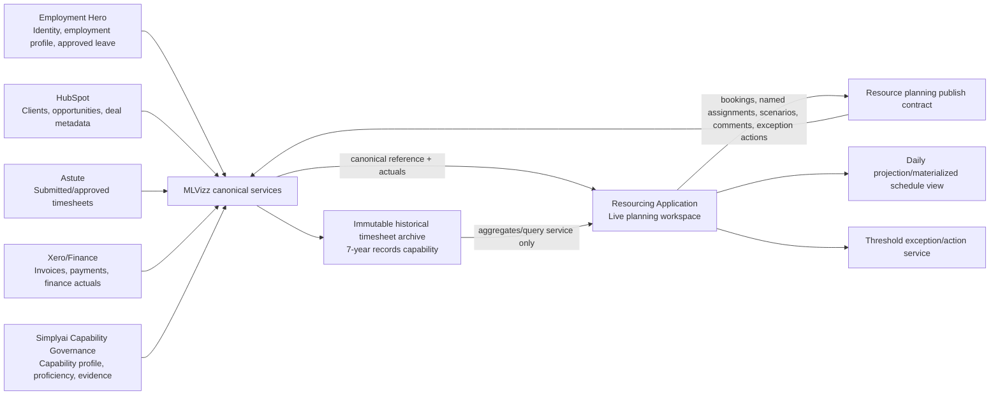

# Resourcing Application Architecture Review

Date: 2026-06-22  
Repo reviewed: `/home/ubuntu/repos/simplyai-transformation`  
Scope: design review only. No material schema or implementation changes have been made.

## Executive summary

The current Resource Command Centre is a strong demo/MVP, but it does not yet implement the target operating model as a durable domain architecture. The main issue is that several distinct concepts are still collapsed into `ResourceAssignment.status`, `ResourceAssignment.type`, presentation RAG, or KPI calculations. The next build should pause feature accretion and introduce a domain layer that separates demand, booking intent, named assignment, actual effort, commercial authority/risk, effective capacity, scenarios, and threshold-driven actions.

The current MLVizz provider boundary is useful and should be retained, but the contract needs a v2 resource-planning model. The application should publish app-owned planning source data to MLVizz and consume governed MLVizz canonical reference/actuals. It should not add point-to-point HubSpot, Employment Hero, Astute, or Xero connectors.

## Evidence reviewed

- Current UI/domain mapper: `src/lib/resource-command-data.ts`
- Current KPI calculator: `src/lib/resource-command-kpis.ts`
- Current MLVizz contract/provider layer: `src/integrations/mlvizz/contracts.ts`
- Current operational DB models: `prisma/schema.prisma`
- Current Resource Command Centre client: `src/app/(app)/resource-command-centre/ResourceCommandCentreClient.tsx`
- Existing MLVizz design note: `docs/mlvizz-resource-integration.md`
- Original BRD attachment: `Simplyai_Resource_Management_App_Design_for_Devin.md`
- MLVizz addendum attachment: `Simplyai_Resource_App_MLVizz_Integration_Addendum_for_Devin.md`

---

# 1. Gap analysis against current implementation

| Target operating model requirement | Current implementation | Gap / impact |
| --- | --- | --- |
| Separate resource demand | Partially present as `ResourceDemand` mapped from `MLVizzResourceRequest` / opportunity data. | Demand is not decomposed into confirmed, tentative, weighted pipeline, requested role lines, and demand lifecycle evidence. |
| Separate soft and hard bookings | Not present as first-class concepts. `AssignmentStatus` includes `Confirmed`, `Tentative`, `Requested`, `Waiting List`, `At Risk`. | Soft/hard booking semantics are conflated with assignment status. This makes capacity and bench calculations ambiguous. |
| Separate named assignments | Partially present as `ResourceAssignment` with `personId`, `projectId`, start/end, pct. | Assignment doubles as booking, allocation, commercial risk, bench/leave/internal marker, and schedule item. |
| Separate timesheet actuals | Present in MLVizz contract as submitted/approved hours. | Actuals are read-only KPI inputs, not modelled as a separate actual-effort domain with immutable historical boundary. |
| Commercial authority and risk | Partially present as `ResourceProject.health`, `AssignmentStatus = At Risk`, and override metadata. | Missing SOW/PO/extension authority objects and risk overlays. Commercial conditions are still likely to become allocation statuses. |
| Effective capacity and availability | Partially calculated from daily capacity and leave. | Capacity does not yet model work calendars, public holidays, capacity reductions, approved leave source evidence, soft booking visibility, or governed internal-work treatment. |
| Scenario planning | Original BRD required it; current app has no first-class scenario model. | Need isolated scenario allocations and promotion via reviewed change sets. |
| Exception/action management | Current UI flags attention and failed records. | Need threshold-driven action records only when financial/capacity/timing/SLA thresholds are crossed. |
| No single RAG/dominant daily status as underlying model | Current UI computes `assignmentRag()` from assignment/project fields. | RAG is presentation-level, but still too coarse: it lacks structured text status, reason, evidence and recommended action, and is anchored on assignment/project status. |
| Bench as residual effective capacity after approved leave and hard-booked commitments | Current KPI bench uses available hours minus all active non-leave/non-bench scheduled work, including tentative/requested/at-risk. | Soft bookings currently reduce bench, which conflicts with the target model. |
| Separate demand/capacity/status buckets | Current KPIs separate some committed/tentative/requested fields but status definitions are still assignment-based. | Need explicit calculation inputs and outputs for confirmed demand, tentative demand, weighted pipeline, hard/soft booked capacity, actual time, commercially authorised work, and work underway at risk. |
| Commercial risk overlay | Not first-class. | Unsigned SOW, unsigned extension, missing PO must be overlays with evidence/action, not booking statuses. |
| Governed internal-work taxonomy | Current assignment types include generic `Internal`, `Training`, `Presales`, `Business Development`; prior spec also referenced Support. | Need governed taxonomy with recoverability/non-recoverability and bench-exposure treatment. |
| Time-phased allocation ranges/contours | Current `ResourceAssignment` and DB planned allocation are date ranges with one flat `allocationPct`. | Need contours/segments over ranges, with calculated/materialised daily projections for schedule views. Avoid making one primary allocation per person per day. |
| Publish source data to MLVizz and consume via MLVizz | Partially present via `ResourceOutboundEvent` and provider boundary. | Need explicit MLVizz publishing contract, idempotency, acknowledgement/retry, and canonical service consumption boundaries. |
| Structured Simplyai capability profile | Current people carry `skills: string[]` and `certifications: string[]`. | Need governed capability taxonomy, proficiency, evidence, endorsements, currency, and source precedence. Employment Hero can seed identity/profile but not authoritatively decide skills. |
| Exception records only above thresholds | Not first-class. | Need configurable thresholds and deterministic exception generation. |
| Seven-year timesheet archive separate immutable capability | Current timesheet actuals are in live snapshot contract. | Need separate archive/read model boundary; live resourcing model should consume summary/reference actuals, not own historical archive transactions. |

---

# 2. Revised domain model

## Core aggregates

### `ResourceDemand`
Represents a role/skill/time requirement before or independent of naming a person.

Key fields:
- `demandId`, `canonicalOpportunityId`, `canonicalProjectId?`, `clientId`
- `demandClass`: `confirmed | tentative | weighted_pipeline`
- `role`, `grade`, `capabilityRequirements[]`, `locationConstraints[]`
- `timePhasedRequirement[]`: date ranges with FTE/hours contours
- `probabilityPct`, `commercialExpectedValue`, `sourceEvidence[]`
- `lifecycleStatus`: `draft | qualified | proposed | confirmed | closed_won | closed_lost | expired`

### `Booking`
Represents capacity being reserved, before or after a person is named.

Key fields:
- `bookingId`, `demandId?`, `scenarioId?`
- `bookingStrength`: `soft | hard`
- `bookingLifecycle`: `proposed | held | requested | approved | committed | released | cancelled | expired`
- `personId?` optional for unnamed/placeholder bookings
- `timePhasedBooking[]`: date ranges with FTE/hours contours
- `source`: `resource-app | mlvizz | imported`
- `approvalEvidence[]`

Rules:
- Soft bookings are visible and can create collision warnings.
- Soft bookings do not remove capacity from bench calculations.
- Hard bookings remove capacity from bench and capacity availability.

### `NamedAssignment`
Represents a named person doing work against a project/demand.

Key fields:
- `assignmentId`, `bookingId`, `personId`, `projectId`
- `workClass`: `client_delivery | managed_service | presales | business_development | governed_internal | training | leave_proxy?`
- `timePhasedAllocation[]`
- `assignmentLifecycle`: `planned | active | complete | cancelled`
- `deliveryStartEvidence`, `deliveryEndEvidence`

Rules:
- A named assignment should usually be backed by a hard booking.
- It should not encode commercial risk as lifecycle status.

### `TimesheetActual`
Represents submitted/approved effort from governed MLVizz actuals.

Key fields:
- `actualId`, `personId`, `projectId`, `workDate`, `submittedHours`, `approvedHours`
- `approvalStatus`: `submitted | approved | rejected | corrected`
- `lineage` to Astute through MLVizz

Rules:
- Seven-year historical archive is not owned here.
- Live model consumes recent/current actuals and aggregates from archive services.

### `CommercialAuthority`
Represents authority to perform/continue/commercially recognise work.

Key fields:
- `authorityId`, `projectId`, `opportunityId?`
- `sowStatus`: `not_required | draft | issued | signed | expired | unsigned_extension`
- `poStatus`: `not_required | requested | received | missing | expired`
- `financeApprovalStatus`: `not_required | pending | approved | rejected`
- `authorityValidFrom`, `authorityValidTo`, `sourceEvidence[]`

### `CommercialRiskOverlay`
Presentation/risk object derived from `CommercialAuthority`, delivery state, finance actuals and thresholds.

Examples:
- `missing_po_for_hard_booked_work`
- `unsigned_sow_for_confirmed_demand`
- `extension_unsigned_inside_threshold`
- `work_underway_at_risk`

### `EffectiveCapacity`
Calculated person/date capacity after employment status, FTE, working pattern, holidays and approved leave.

Inputs:
- Employment profile through MLVizz/Employment Hero
- Approved leave through MLVizz/Employment Hero
- Public holidays / work calendar
- Contract end dates / inactive periods

### `InternalWorkAllocation`
Governed internal work, not a generic support bucket.

Suggested taxonomy:
- `practice_build`: recoverable? false by default
- `product_accelerator`: recoverable? configurable
- `sales_enablement`: recoverable? partial
- `training_certification`: recoverable? false unless funded
- `operations_governance`: recoverable? false
- `community_ip`: recoverable? configurable
- `support_warranty`: recoverable? depends on contract

Each category must carry:
- `governanceOwner`
- `recoverability`: `recoverable | partially_recoverable | non_recoverable`
- `fundingSource`: `client | internal_investment | overhead | sales | training_budget`
- `benchExposurePolicy`: whether it is displayed as bench exposure, non-recoverable capacity, or both.

### `Scenario`
Isolated planning sandbox.

Key fields:
- `scenarioId`, `name`, `ownerId`, `baselineSnapshotId`
- `scenarioBookings[]`, `scenarioAssignments[]`, `scenarioDemandAdjustments[]`
- `comparisonMetrics`
- `promotionChangeSetId?`

Rules:
- Scenario changes never affect live plan until promoted through a reviewed change set.

### `ExceptionAction`
Generated only when thresholds are crossed.

Key fields:
- `actionId`, `exceptionType`, `severity`, `thresholdId`
- `status`: `open | assigned | deferred | resolved | suppressed`
- `ownerId`, `dueAt`, `recommendedAction`
- `evidenceRefs[]`, `sourceCalculationId`

---

# 3. Proposed status and calculation definitions

## Status definitions

### Demand status
- `confirmed_demand`: delivery requirement tied to closed-won/approved project or authorised work package.
- `tentative_demand`: credible requirement not yet commercially or delivery confirmed.
- `weighted_pipeline_demand`: opportunity-derived demand weighted by probability and timing.

### Booking status
- `soft_booked_capacity`: provisional reservation. Visible in schedule and conflicts, excluded from bench removal.
- `hard_booked_capacity`: approved/committed reservation. Removes capacity from residual bench.

### Assignment status
- `named_assignment_planned`: named person planned for delivery.
- `named_assignment_active`: named person currently inside active allocation range.
- `named_assignment_complete`: allocation ended.
- `named_assignment_cancelled`: explicit cancellation.

### Actuals status
- `submitted_time`: timesheet submitted but not approved.
- `approved_time`: approved timesheet effort.
- `invoiced_actual`: finance actual invoiced.
- `paid_actual`: finance actual paid.

### Commercial overlay status
- `commercially_authorised_work`: SOW/PO/finance conditions satisfied or authorised override present.
- `work_underway_at_risk`: delivery/booking/actual work exists but commercial authority is missing/expired/inside warning threshold.

## Calculation definitions

### Effective capacity
```text
effective_capacity_hours(person, day)
= contractual_hours_for_work_pattern(person, day)
- approved_leave_hours(person, day)
- public_holiday_hours(person, day)
- inactive_or_contract_ended_hours(person, day)
```

### Hard-booked capacity
```text
hard_booked_hours(person, day)
= sum(hard bookings and backed named assignments for person/day)
```

### Soft-booked capacity
```text
soft_booked_hours(person, day)
= sum(soft bookings for person/day)
```

Soft booked capacity is displayed, used for collision warnings and scenario comparisons, but does not reduce bench.

### Bench exposure
```text
bench_exposure_hours(person, day)
= max(0, effective_capacity_hours(person, day) - hard_booked_hours(person, day))
```

### Non-recoverable internal capacity
```text
non_recoverable_internal_hours(person, day)
= sum(governed internal work where recoverability = non_recoverable)
```

Display both:
- `bench_exposure_hours`: resource exposure before hiding anything behind internal categories.
- `non_recoverable_internal_hours`: portion of capacity consumed by governed internal work.

### Confirmed demand
```text
confirmed_demand_hours(day)
= sum(demand contours where demandClass = confirmed)
```

### Tentative demand
```text
tentative_demand_hours(day)
= sum(demand contours where demandClass = tentative)
```

### Weighted pipeline demand
```text
weighted_pipeline_hours(day)
= sum(pipeline_demand_hours(day) * probabilityPct / 100)
```

### Commercially authorised work
```text
commercially_authorised_hours(day)
= hard_booked_or_actual_hours(day) where authority status is valid
```

### Work underway at risk
```text
work_underway_at_risk_hours(day)
= hard_booked_or_actual_hours(day) where commercial risk overlay severity >= threshold
```

### Attention/RAG presentation signal
Every colour indicator must be derived from a structured signal:

```ts
type AttentionSignal = {
  color: "green" | "amber" | "red";
  statusText: string;
  reason: string;
  sourceEvidence: EvidenceRef[];
  recommendedAction: string;
  thresholdId?: string;
};
```

Examples:
- Green: `Hard booked and commercially authorised`.
- Amber: `Soft booking overlaps available capacity`.
- Red: `Hard booked work starts in 5 days with missing PO`.

No RAG value should be persisted as the source status.

---

# 4. Integration and system-of-record diagram



## System-of-record ownership

| Domain | System of record | Resource app behaviour |
| --- | --- | --- |
| Identity, employment status, contract dates, approved leave | Employment Hero via MLVizz | Consume, do not directly edit. |
| Clients, opportunities, deal metadata | HubSpot via MLVizz | Consume canonical objects, no direct HubSpot connector. |
| Submitted/approved timesheets | Astute via MLVizz | Consume current actuals; archive stays separate. |
| Invoices, paid actuals, finance state | Xero/finance via MLVizz | Consume with finance/RBAC controls. |
| Skills/capabilities | Simplyai governed capability service/profile via MLVizz | App can manage/augment governed profile; Employment Hero only seeds identity/profile. |
| Bookings, named assignments, scenarios, comments, exception actions | Resourcing app | Publish source data to MLVizz via governed contract. |
| Historical timesheet archive | Immutable records-management capability | Query/aggregate only; not live transaction model. |

---

# 5. Conflicting existing requirements

1. **Original “daily granularity as underlying storage” vs new time-phased contours.**  
   Current target says use time-phased allocation ranges/contours and produce daily projections, not one primary allocation record per person per day.

2. **RAG as schedule colour rule vs RAG as derived presentation signal.**  
   Earlier requirement asked for RAG colour coding. Revised rule says RAG cannot be a persisted or dominant model concept and must carry text/reason/evidence/action.

3. **Bench duration reset after official delivery vs residual effective-capacity bench.**  
   Earlier bench feature emphasised duration since last official delivery. Revised target requires bench as residual effective capacity after approved leave and hard bookings. Duration can remain as a secondary presentation metric, not the core bench definition.

4. **`At Risk` assignment status vs commercial-risk overlay.**  
   Current implementation has `AssignmentStatus = At Risk`. Revised model says unsigned SOW, unsigned extension and missing PO are overlays, not allocation statuses.

5. **Generic/internal/support categories vs governed internal-work taxonomy.**  
   Existing assignment types are too broad. Revised model requires recoverability and non-recoverable capacity visibility.

6. **Direct HubSpot-facing UI language vs MLVizz canonical source boundary.**  
   UI can display HubSpot deal IDs/source evidence, but it should consume them through MLVizz contracts, not direct HubSpot integration assumptions.

7. **Skills arrays from people profile vs governed capability profile.**  
   Current `skills: string[]` is insufficient for matching. Employment Hero cannot be treated as authoritative skills source.

8. **Live resourcing model vs seven-year timesheet archive.**  
   Current MLVizz snapshot includes actuals. Revised target requires historical timesheets to be a separate immutable records capability, with the live app consuming only needed actuals/aggregates.

---

# 6. Proposed Priority 0 scope

Priority 0 should be an architecture-hardening slice, not another UI feature batch.

## P0.1 Domain contract v2 design
- Define the v2 canonical resource-planning contract:
  - `ResourceDemand`
  - `Booking`
  - `NamedAssignment`
  - `AllocationContour`
  - `EffectiveCapacity`
  - `CommercialAuthority`
  - `CommercialRiskOverlay`
  - `AttentionSignal`
  - `InternalWorkCategory`
  - `Scenario`
  - `ExceptionAction`
  - `CapabilityProfile`
- Produce fixture examples before schema migration.

## P0.2 Calculation service design
- Define pure calculations for:
  - effective capacity
  - hard-booked capacity
  - soft-booked capacity
  - bench exposure
  - non-recoverable internal capacity
  - confirmed/tentative/weighted demand
  - work underway at risk
  - attention signals
- Add deterministic expected-value tests against synthetic fixtures.

## P0.3 MLVizz integration pattern
- Retain MLVizz provider boundary.
- Replace point-to-point concepts with canonical MLVizz service contracts.
- Define outbound publish envelope for app-owned planning source data.
- Add idempotency, replay, acknowledgement and failure handling requirements.

## P0.4 Migration plan only, no destructive schema change
- Map existing `ResourcePlannedAllocation` and `ResourceAssignment` concepts to the new model.
- Identify incompatible statuses/types.
- Design backfill/reconciliation reports before migration.

## P0.5 UI compatibility plan
- Keep current pages working while introducing calculated daily projections.
- Replace visual-only RAG with structured attention signals.
- Keep person/engagement drilldowns but drive them from revised domain objects.

---

# 7. Migration and reconciliation impacts

## Current objects to migrate

### `ResourcePlannedAllocation`
Current fields are `canonicalAllocationId`, `canonicalPersonId`, `canonicalProjectId`, `status`, `allocationType`, date range, flat `allocationPct`, `confidencePct`, and JSON payload.

Migration impact:
- Split into `Booking`, `NamedAssignment`, and `AllocationContour`.
- Map `status` carefully:
  - `planned/Confirmed` -> likely hard booking + named assignment if person exists.
  - `tentative` -> soft booking, not capacity removal.
  - `requested` -> demand/booking request, not assignment.
  - `at_risk` -> remove from assignment status; create commercial/operational risk overlay.
- Preserve original payload and history for audit.

### `ResourceAllocationHistory`
Current history can remain but should reference change sets and domain aggregate IDs rather than only allocation IDs.

### `ResourceComment`
Should continue, but target types need to expand from `assignment/person/project/demand` to include booking, scenario, exception and commercial authority.

### `ResourceOutboundEvent`
Should evolve into the MLVizz planning publish envelope:
- idempotency key
- schema version
- aggregate type/id
- operation type
- source event sequence
- publish status/ack status
- retry/failure reason

## Reconciliation requirements

1. **Demand reconciliation**: HubSpot/MLVizz demand vs resource-app bookings and assignments.
2. **Capacity reconciliation**: Employment Hero leave/profile vs resource-app capacity projections.
3. **Commercial reconciliation**: hard-booked/active work vs SOW/PO/finance authority.
4. **Actuals reconciliation**: approved Astute actuals vs named assignments and hard bookings.
5. **Publish reconciliation**: resource-app outbound events vs MLVizz accepted source records.
6. **Historical archive reconciliation**: live actual summaries vs immutable archive aggregate counts, without importing archive into transaction tables.

---

# 8. Architecture decision records

## ADR-001: Booking model separation

**Status:** Proposed  
**Context:** Current implementation uses assignment status/type to represent booking intent, named delivery work, bench/leave/internal states and risk. This prevents accurate capacity, bench and scenario calculations.  
**Decision:** Introduce separate `ResourceDemand`, `Booking`, `NamedAssignment` and `AllocationContour` aggregates. Soft/hard booking strength is modelled independently from assignment lifecycle. Daily schedule views are calculated/materialised projections.  
**Consequences:** More upfront modelling and migration work, but accurate bench, capacity, demand and scenario planning become possible. UI can still present a simple schedule while the model remains correct.

## ADR-002: Commercial-risk overlay

**Status:** Proposed  
**Context:** Missing PO, unsigned SOW and unsigned extension are commercial authority/risk conditions, not resource allocation statuses. Treating them as statuses corrupts utilisation and capacity logic.  
**Decision:** Model `CommercialAuthority` and derive `CommercialRiskOverlay`/`AttentionSignal` records from authority, bookings, actuals and thresholds. Do not encode commercial risk as assignment lifecycle.  
**Consequences:** Schedule can show work as hard-booked/active while separately flagging commercial risk with reason, evidence and action. Finance/commercial governance can evolve without rewriting allocation logic.

## ADR-003: MLVizz integration pattern

**Status:** Proposed  
**Context:** The resource app needs HubSpot, Employment Hero, Astute and finance data but should not become an unmanaged integration hub. The prior addendum introduced MLVizz provider contracts; the new target reinforces that boundary.  
**Decision:** Use MLVizz as the canonical governed service boundary for inbound reference/actual data and outbound resource-app planning source data. The resource app publishes bookings, assignments, scenarios, comments and exceptions to MLVizz through an idempotent publish contract. No direct unmanaged HubSpot/Employment Hero/Astute/Xero point-to-point integrations.  
**Consequences:** Switching from synthetic to production MLVizz remains configuration/integration work, but MLVizz must expose/accept the revised v2 planning contract and acknowledgements.

---

# Recommended next decision

Approve Priority 0 as a design-and-contract hardening pass before any schema implementation. The next implementation should not add more UI behaviour until the v2 domain contract, calculation definitions, migration map and contract tests are agreed.
